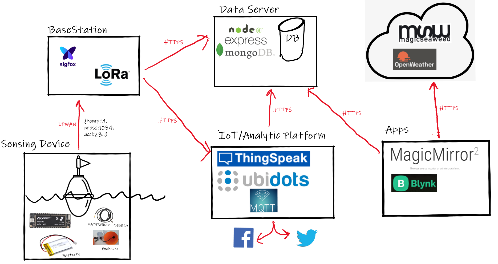
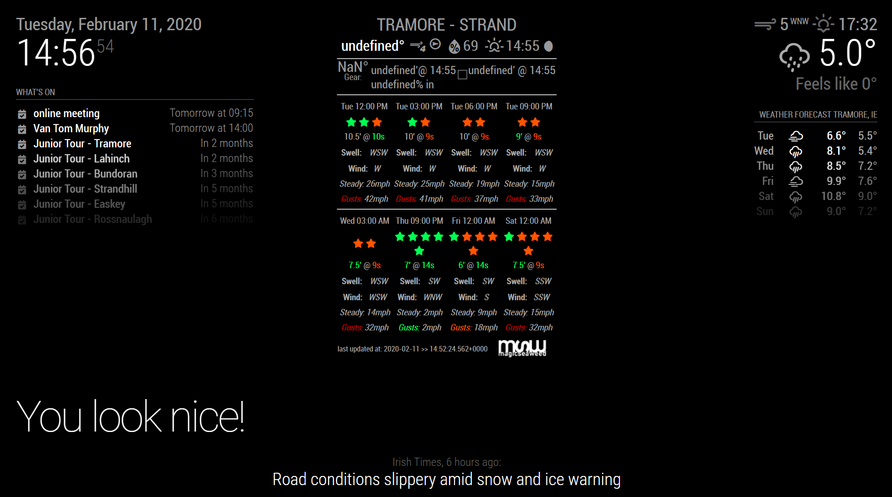

# TBay Marine Monitor 

A marine environment monitoring and logging system using Low Power Wide Area Network (LPWAN) and open source web standards and protocols

# Proposed Work Packages:

## Sensing Device

Design and build ocean proof enclosure housing microcontroller connected to sensors (at least temperature). Enclosure to be attached to marine buoy.

**Requirements**

- LPWAN enabled micrrocontrolled (Pycom SiPy/LoPy)
- LiPo battery (high capacity)
- Waterproof temperature Sensor (DS18B20)
- Ocean proof housing allowing for exposure of antenna and temperature sensor. (3d printed).
- Optional: accelerometer, Gyro, GPS

## BaseStation (LPWAN)

Design and implement suitable base station for data collection/aggregation. Implement "hooks" to higher order web platform/services.

**Requirements**

- LPWan base station/backend (Sigfox/Lorawan)
- Data packet design (payload format)
- Web API integration (data server and IoT Platform)
- Security (authentication/ encryption)
- Device Power Monitoring (battery level)

## Data Server

Design and implement secured Web API to post and access data. Design and implement data persistence (DB).

**Requirements**

- API design ([swagger](swagger.io))
- API implementation ([express](https://expressjs.com/),[flask](https://www.palletsprojects.com/p/flask/),[Firebase](https://firebase.google.com/) )
- Database design and provisioning ([MongoDB](https://www.mongodb.com/), [tinydb](https://tinydb.readthedocs.io/en/latest/), [Firebase](https://firebase.google.com/))
- Security and Authentication

## Analytics/IoT platform

Implement events/triggers based on data. Visualise and analyse data.

**Requirements**

- IoT platform for monitoring data ([Thingspeak](https://thingspeak.com/), [Ubidots](https://ubidots.com/),MQTT)
- Design and implement logic and rules (low temp warning, no recent update warning)
- Create embeddable visualisation "widgits" (line graph, Ave Temp Field)
- Social Media integration (Twitter, Facebook, Slack, eMail)

## Application/Front end

Design and implement front end application that uses and visualises data. Combine with data from other third party services.

**Requirements**

- Dashboard/Framework based web application ([Magic Mirror](https://magicmirror.builders/))
- Mobile App ([Blynk](https://blynk.io/))
- Bespoke Web Application (integrated with IoT platform)

## Timeline

1. Work Package Selection: 21/2/2020
2. Team Formation/Proposal (Github Repo): 28/2/2020
3. Project Graphics/Benchmarks: 13/3/2020
4. Interim Presentation/Review: 30/3/2020
5. Final Presentation/Demonstration: 29/4/2020

